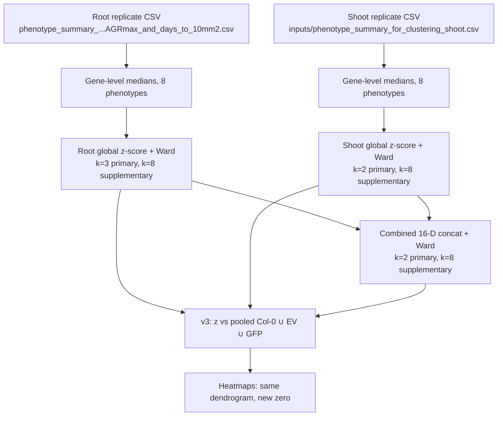

# *H. schachtii* BM-effector phenotype clustering (pooled-control heatmaps)

Ward clustering of BM effector infection phenotypes in **root** (*Heterodera schachtii*) and **shoot** (Beth lesion assay), then recolouring against the pooled Col-0 / EmptyVector / GFP baseline.

White in the v3 heatmaps is **control-like**, not library-average. Row order and cluster colours are the original Ward partitions.

## Pipeline



**Colour:** `z = (gene median − pooled control median) / SD(gene medians)`. Red = above pooled controls, blue = below, white = `|z| < 0.25`.

### 1. Root (k=3)

Low-growth trio **BM00053 / BM00084 / BM00088** at the bottom (C1). Controls and **BM00079** in C3; BM00079 is the high-growth leaf at the top.


### 2. Shoot (k=2)

C1 is the same low-growth trio plus **BM00068** (shoot-only). Remaining genes, including controls, in C2.


### 3. Combined root + shoot (k=2, 16-D)

75 shared genes. C1 = BM00053 / BM00084 / BM00088. BM00079 at the high-growth end.


k=8 cuts of the same trees are in `02.v3_pooled_control_heatmaps/figures/main/` (`*_k8.jpeg` / `*.pdf`). Compact (unlabelled) versions sit next to the labelled files.

---

## What is in this folder (published snapshot)

Only files the v3 script **reads** or **writes**. Local unpublished clustering figures (TIFF/SVG, k=5–7 panels) are not tracked.

| Path | Role |
|------|------|
| `phenotype_summary_for_clustering_with_AGRmax_and_days_to_10mm2.csv` | Root replicate input |
| `01.clustering_analysis/tables/gene_level_median_zscore.csv` | Root dendrogram (global z) |
| `01.clustering_analysis/tables/gene_cluster_assignments_recommended_relabelled.csv` | Root k=3 labels |
| `01.clustering_analysis/tables/gene_cluster_assignments_k8_relabelled.csv` | Root k=8 labels |
| `02.v3_pooled_control_heatmaps/inputs/phenotype_summary_for_clustering_shoot.csv` | Shoot replicate input |
| `02.v3_pooled_control_heatmaps/inputs/shoot_*.csv` | Shoot dendrogram + k=2/k=8 labels |
| `02.v3_pooled_control_heatmaps/inputs/combined_*.csv` | Combined 16-D dendrogram + k=2/k=8 labels |
| `02.v3_pooled_control_heatmaps/scripts/run_ctrl_heatmaps_v3.py` | Recolour + heatmap script |
| `02.v3_pooled_control_heatmaps/tables/` | Pooled-control z-scores and baselines |
| `02.v3_pooled_control_heatmaps/figures/` | jpeg + pdf heatmaps |
| `02.v3_pooled_control_heatmaps/reports/` | Methods + run summary |

---

## Re-run

```bash
cd 10.Hschachtii_PhenotypeCluster
python3 02.v3_pooled_control_heatmaps/scripts/run_ctrl_heatmaps_v3.py
```

Requires Python 3.13 with pandas, numpy, scipy, scikit-learn (not used at plot time), matplotlib, seaborn.

The script aborts unless the root k=3 heatmap has BM00079 at the top (red, C3) and BM00084 / BM00088 / BM00053 at the bottom (blue, C1).

---

## Related

- `11.Hglycines_clustering` — *H. glycines* expression clustering
- `07.Hschachtii_TPM` — *H. schachtii* bulk TPM
