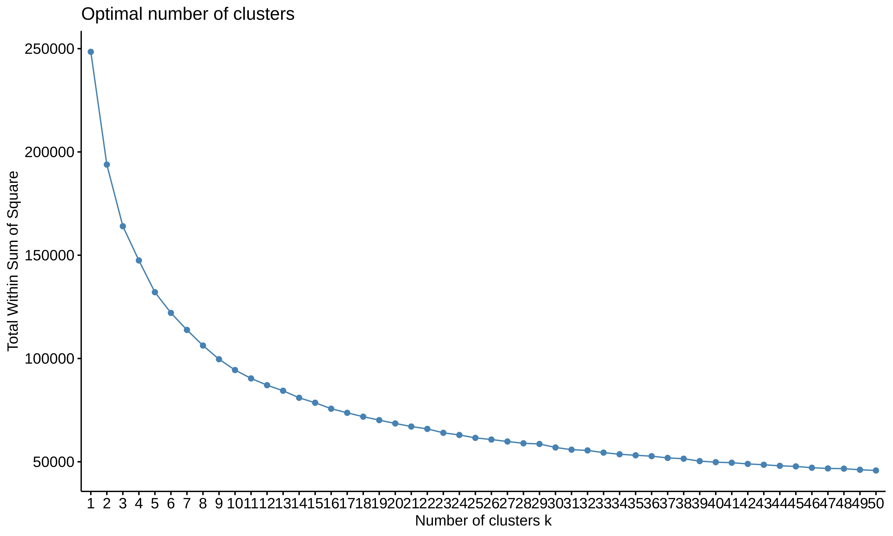
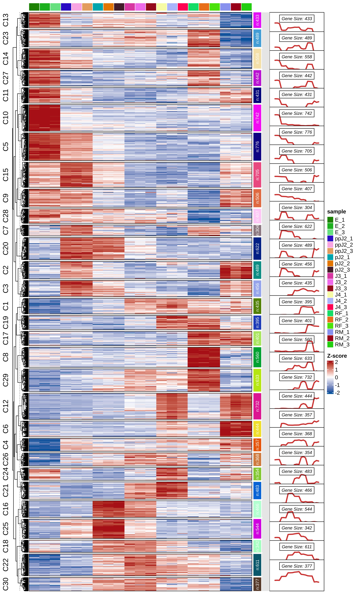

# *H. glycines* gene-centred VST expression clustering (Mfuzz, k=30)

<!-- GitHub renders tracked images from relative paths -->

## Overview

Soft-clustering of **14,862 *Heterodera glycines* genes** by VST-normalised expression profiles across 7 developmental stages / conditions, using **Mfuzz** (fuzzy c-means) via the `ClusterGVis` R package.

### Biological context

*H. glycines* (soybean cyst nematode) progresses through several developmental stages inside the host root. Understanding which genes are co-expressed across these stages reveals transcriptional programmes underlying parasitism, feeding-site establishment, and reproduction.

### Experimental design

| Condition | Description | Replicates |
|-----------|-------------|------------|
| E | Eggs | 3 |
| ppJ2 | Pre-parasitic J2 | 3 |
| pJ2 | Parasitic J2 | 3 |
| J3 | J3 | 3 |
| J4 | J4 | 3 |
| RF | Reproductive Female | 3 |
| RM | Male | 3 |

**21 samples total** — 3 biological replicates per condition.

---

## Files

| File | Description | Size |
|------|-------------|------|
| `01.cluster.R` | Clean R script — full reproducible analysis (k=30 only) | 5.5 KB |
| `03.TPM4cluster.tsv` | Input: VST-normalised expression (14,862 genes × 21 samples) | 5.9 MB |
| `05.cm.30clusters.csv` | Output: k=30 cluster assignments + membership scores | 6.2 MB |
| `04.getCluster.pdf` | Elbow plot (vector) | 3.6 KB |
| `04.getCluster.jpeg` | Elbow plot (raster, 600 dpi) | 570 KB |
| `05.k30.line_heatmap.pdf` | Line + heatmap visualisation (vector) | 395 KB |
| `05.k30.line_heatmap.jpeg` | Line + heatmap visualisation (raster, 600 dpi) | 5.5 MB |

---

## Method

### Input data

The input `03.TPM4cluster.tsv` contains **VST (Variance Stabilising Transformation) normalised** expression values derived from RNA-seq counts. Each value is centred and scaled across samples, making expression profiles comparable across genes regardless of absolute expression level.

### Cluster number selection

The optimal number of clusters was determined by **k-means WSS (within-cluster sum of squares)** elbow analysis for k = 1–50. The second-derivative method identified the elbow point. After exploring k = 12, 15, 20, and 30, **k = 30** was selected as the final cluster number, providing the best resolution of distinct expression patterns across the 7 developmental stages.

### Mfuzz soft clustering

Mfuzz implements **fuzzy c-means clustering**, which assigns each gene a **membership score** (0–1) for every cluster. This is biologically appropriate for transcriptomic data because:

- Genes can participate in multiple regulatory programmes
- Co-expression modules are often overlapping, not discrete
- The membership score quantifies confidence in the assignment

The final hard assignment is the cluster with the highest membership score.

### Visualisation

The "both" plot type shows:
- **Top panel**: Mean expression profile per cluster (line plot, ± variability)
- **Bottom panel**: Heatmap of all individual gene expression within each cluster

Colour gradient: green (low) → orange (mid) → red (high).

---

## Results

### Elbow plot



The elbow plot shows the within-cluster sum of squares (WSS) as a function of k. The rate of improvement decreases sharply after k ≈ 20–30.

### k=30 Line + heatmap visualisation



Each of the 30 panels represents one cluster, showing:
- **Left**: Mean expression profile across the 7 conditions (ordered by time: E → pJ2 → ppJ2 → J3 → J4 → RF → RM)
- **Right**: Heatmap of individual gene expression within the cluster

---

## Reproducibility

### Dependencies

```r
# R 4.x, Bioconductor
BiocManager::install(c("ClusterGVis", "Biobase", "Mfuzz"))
install.packages("factoextra")
```

### Run the analysis

```bash
# From the 11.Hglycines_clustering/ directory
Rscript 01.cluster.R
```

This will regenerate all output files.

### Input data provenance

`03.TPM4cluster.tsv` is derived from RNA-seq counts processed through:
1. **StringTie** — transcript assembly and quantification
2. **VST normalisation** — via DESeq2's varianceStabilisingTransformation
3. **Gene-centred centring** — each gene's expression values centred across samples

---

## Cluster assignment format (`05.cm.30clusters.csv`)

| Column | Description |
|--------|-------------|
| `gene` | H. glycines gene ID (e.g., Hg_chrom1_TN10gene_2197) |
| `E_1`–`RM_3` | VST-normalised expression, 21 sample columns |
| `cluster` | Hard cluster assignment (1–30) |
| `membership` | Mfuzz membership score for the assigned cluster (0–1) |

---

## Related projects in this repository

- `07.Hschachtii_TPM` — H. schachtii bulk TPM expression
- `08.Proteomics_clustering` — Proteomics clustering analysis
- `10.Hschachtii_PhenotypeCluster` — Root/shoot phenotype clustering
