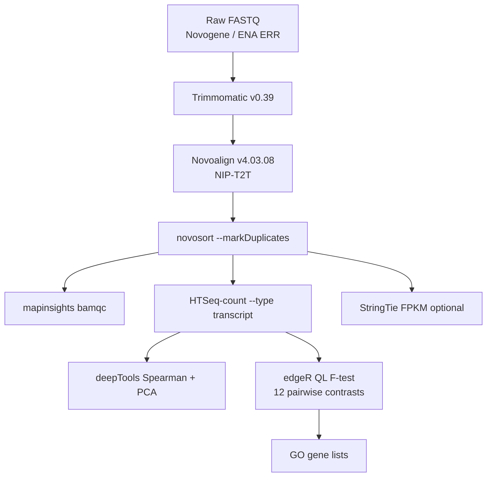
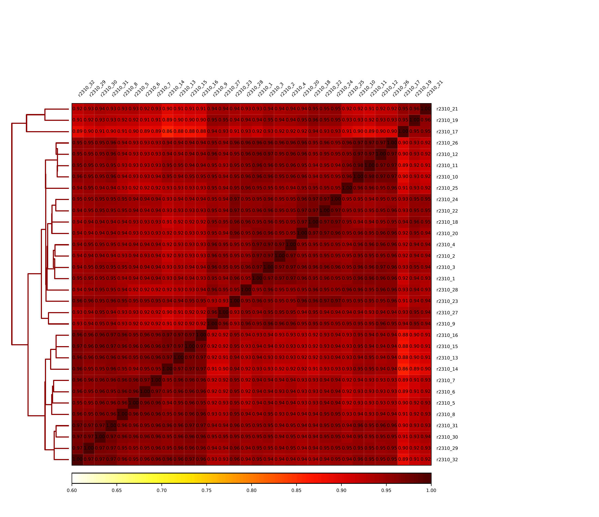
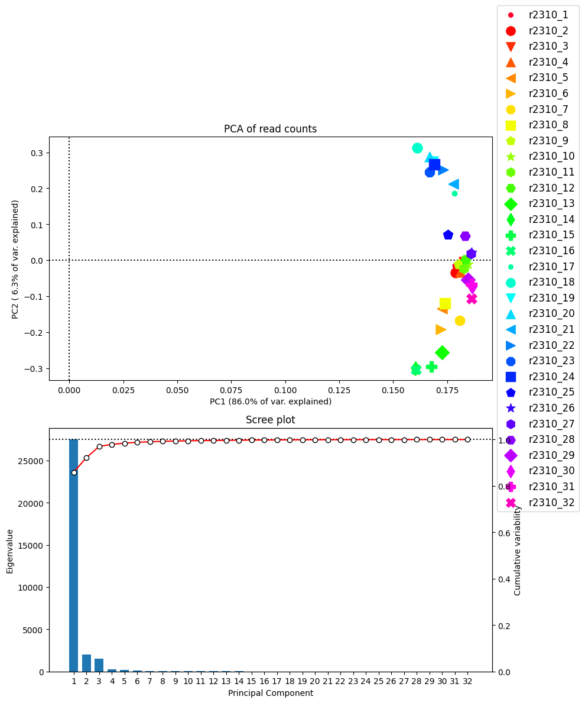
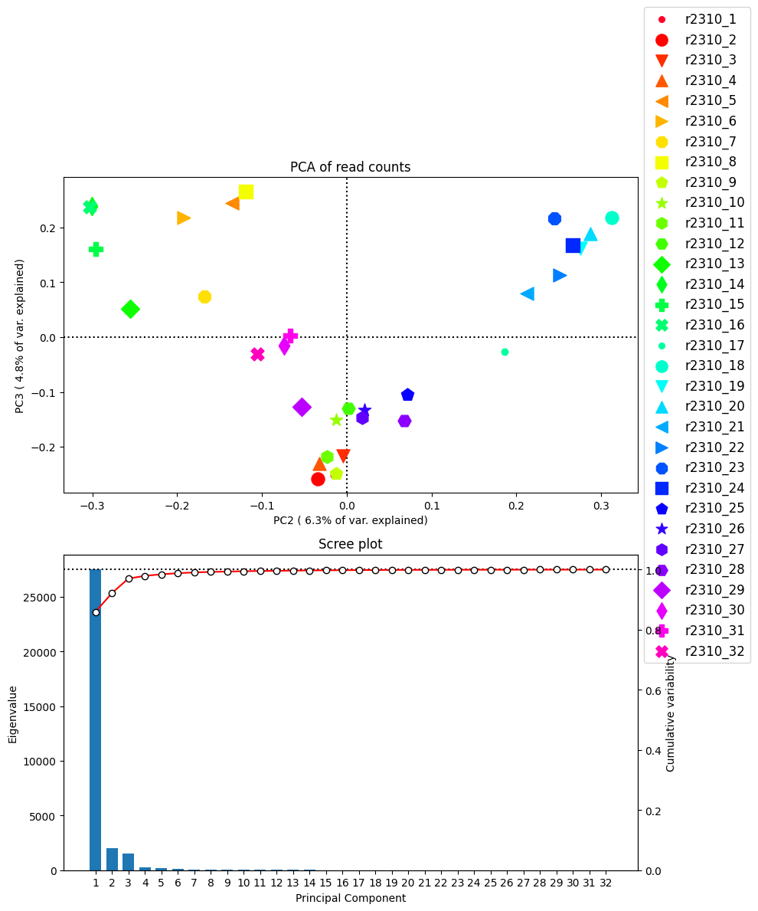
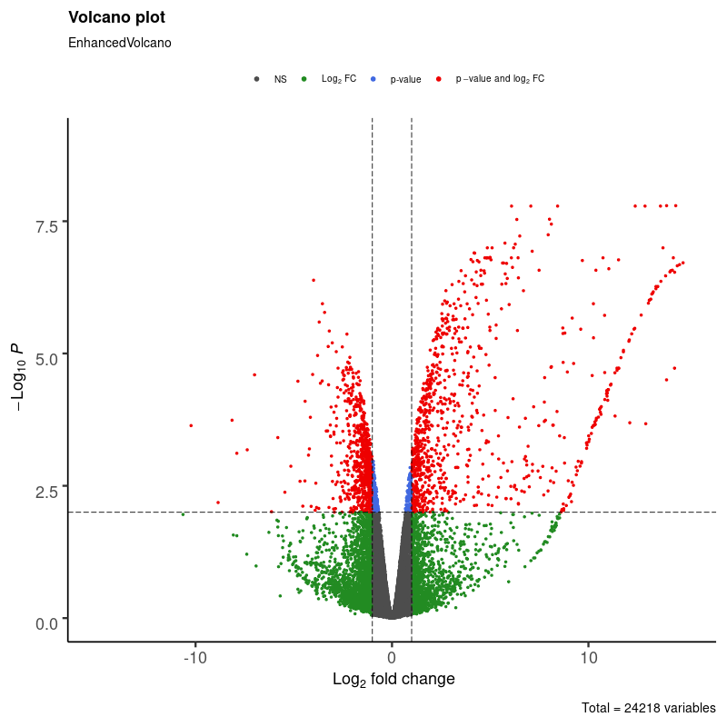
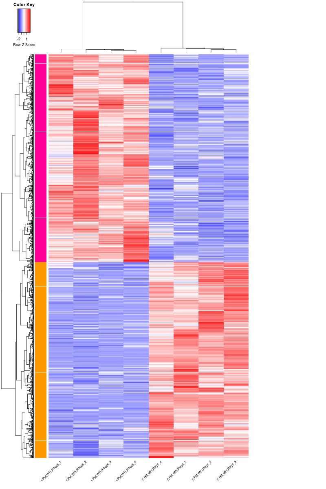
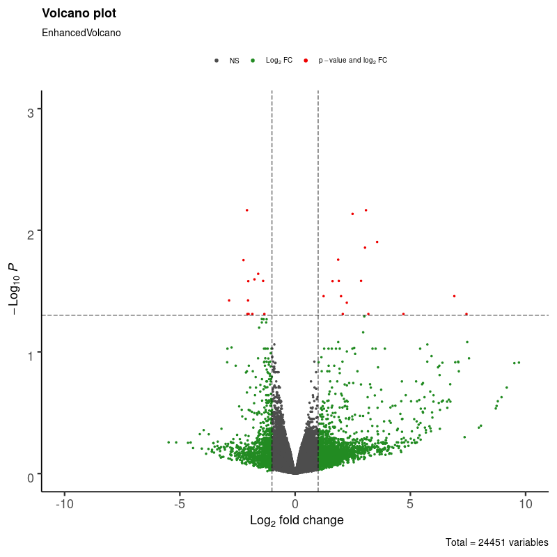
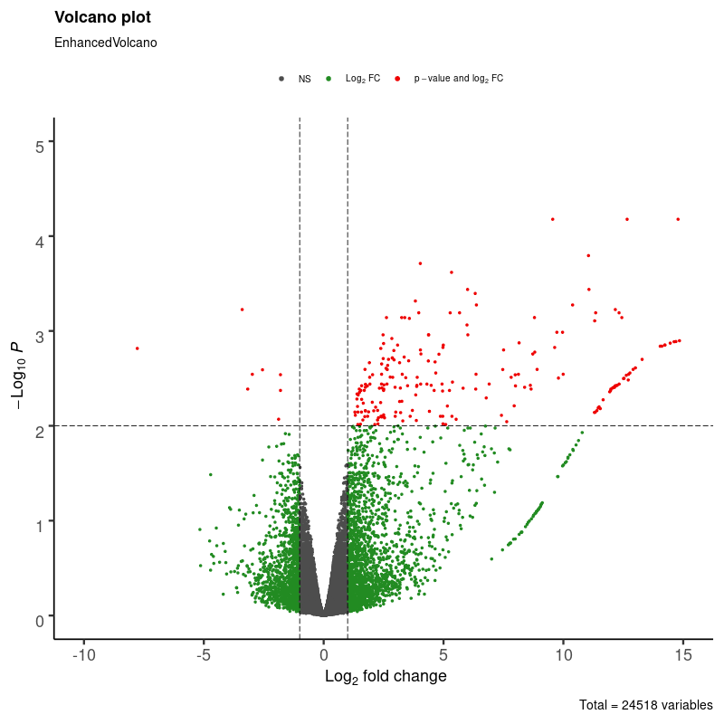
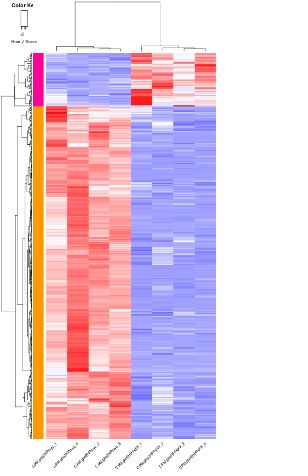
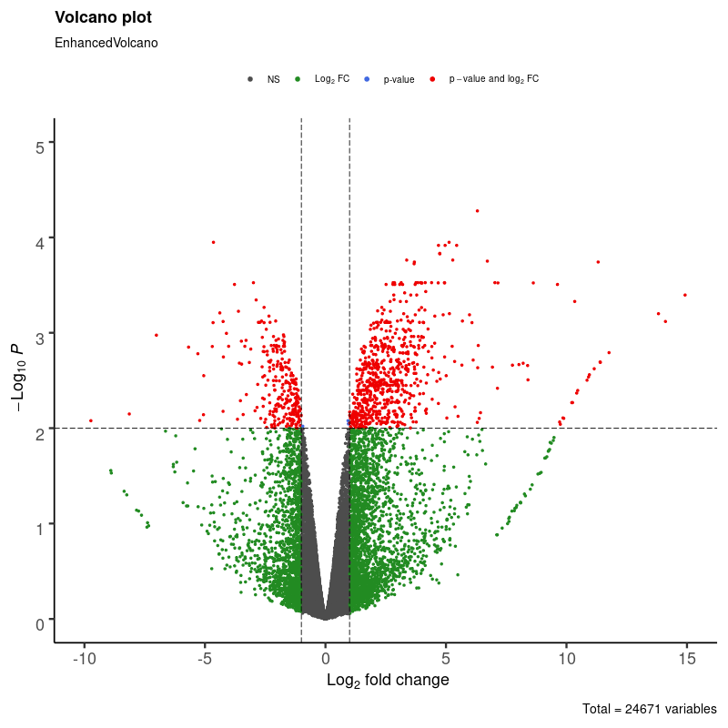

# Rice AM × PHO2 root RNA-seq (Saskia)

Rice (*Oryza sativa* ssp. Japonica cv. Nipponbare) root mRNA-seq: **wild type vs `pho2`**, **low vs high phosphate**, **mock vs *Rhizophagus irregularis***, four biological replicates (32 libraries).

Paper: *PHOSPHATE OVERACCUMULATOR 2 (PHO2) is a negative regulator of arbuscular mycorrhizal symbiosis* (`docs/Project.txt`). PHO2 is an E2 ubiquitin-conjugating enzyme of Pi homeostasis; `pho2` keeps high AM colonisation even at high Pi.

This GitHub folder is the **curated CSD3 analysis + ENA pack**. Raw FASTQ and BAMs stay on HPC (`/rds/user/cx264/hpc-work/project/2.Jeongmin/01.Saskia`) and at ENA. Historical lab notebook: `docs/11.script.txt`.

**Two analysis stacks exist. Do not mix them.**

| | This folder (CSD3, figures and tables below) | Paper methods (`docs/MaterialMethod.txt`) |
|---|---|---|
| Genome | NIP-T2T ([Rice Super Pan-genome](http://www.ricesuperpir.com)) | MSU v7 / Phytozome |
| Quantify | Novoalign v4.03.08 + HTSeq `--type transcript` | Salmon v0.7 quasi-mapping |
| DE | edgeR QL F-test, `~Time + group` | DESeq2 |
| Cut-off | FDR &lt; 0.05 and \|logFC\| &gt; 1 | FDR ≤ 0.05 and \|FC\| ≥ 1.5 |

The folder name `de/FDR_0.01/` is historical. The R scripts saved DE genes at **FDR &lt; 0.05 and \|logFC\| &gt; 1**. `de/FDR_0.05/` is a looser unadjusted *P* &lt; 0.05 gene-list pass used for GO.

---

## Experimental design

| Libraries | Genotype | Pi | Inoculation |
|-----------|----------|----|-------------|
| r2310_1–4 | WT | 25 µM (LP) | mock |
| r2310_5–8 | WT | 25 µM (LP) | *R. irregularis* (600 spores) |
| r2310_9–12 | pho2 | 25 µM (LP) | mock |
| r2310_13–16 | pho2 | 25 µM (LP) | *R. irregularis* |
| r2310_17–20 | WT | 250 µM (HP) | mock |
| r2310_21–24 | WT | 250 µM (HP) | *R. irregularis* |
| r2310_25–28 | pho2 | 250 µM (HP) | mock |
| r2310_29–32 | pho2 | 250 µM (HP) | *R. irregularis* |

Growth: autoclaved silica sand, CONVIRON EVO (12 h light, 28/20 °C, 65% RH), half-strength Hoagland. Tissue: **root**. Collection: **2023-10**, United Kingdom. Sequenced 150 bp PE mRNA (oligo-dT) on **Illumina NovaSeq 6000** (Novogene, Cambridge). `pho2` allele was not distinguished in the metadata (`pho2-1` NF2586 vs `pho2-2` NE9017).

Four libraries were sequenced on two flowcells and concatenated before analysis and ENA submit: **r2310_1, 8, 19, 23**.

Replicates 1–4 are paired experimental batches (`Time` in the DE model), not independent greenhouse runs of a different design.

---

## Analysis pipeline

Commands below are what was run on CSD3. FASTQ/BAM are not in git; set `ROOT` and `REF` if you re-run.

```bash
ROOT=/rds/user/cx264/hpc-work/project/2.Jeongmin/01.Saskia
REF=/rds/user/cx264/hpc-work/project/0.ref/1.Rice_Nipponbare
```



### 0. Reference genome

NIP-T2T genome and GFF3 from [ricesuperpir.com](http://www.ricesuperpir.com). CDS/protein via `gffread`; GO via InterProScan 5.66; KEGG via kofam_scan 1.3.0; Novoalign index.

```bash
cd "$REF"
wget http://www.ricesuperpir.com/uploads/common/genome_sequence/NIP-T2T.fa.gz
wget http://www.ricesuperpir.com/uploads/common/gene_annotation/NIP-T2T.gff3.gz
gffread -x NIP-T2T_CDS.fasta -g NIP-T2T.fa NIP-T2T.gff3
gffread -y NIP-T2T_aa.fasta -g NIP-T2T.fa NIP-T2T.gff3
gffread -T NIP-T2T.gff3 -o NIP-T2T.gtf

# GO (Pfam + InterPro)
interproscan.sh -i NIP-T2T_aa.fasta -f tsv -appl Pfam --goterms -pa --iprlookup --cpu 2

# Novoalign index
novoindex NIP-T2T.index NIP-T2T.fa
```

### 1. Raw reads

Originally Novogene project `X204SC23091440-Z01-F002` (two tarballs: `F002_01` has r2310_4–9 and 32; `F002_02` the rest). Those download URLs have expired.

Re-download from ENA after the hold date (or with Webin while private): BioProject [PRJEB125245](https://www.ebi.ac.uk/ena/browser/view/PRJEB125245), runs **ERR17796168–ERR17796199**. Per-library ERR/ERS: `ena/accessions_registered.tsv`. Submit **raw** reads, not Trimmomatic output.

### 2. Adapter / quality trim

Trimmomatic v0.39, paired-end. Drop bases Q &lt; 20 at ends, sliding window 4:20, keep reads ≥ 60 bp.

```bash
# F002_01 and F002_02 were trimmed the same way (loop over each tarball's 01.RawData)
java -jar trimmomatic-0.39.jar PE -threads 4 -summary ${sample}.summary \
  ${sample}_1.fq.gz ${sample}_2.fq.gz \
  ${sample}_1P.fq.gz ${sample}_1U.fq.gz \
  ${sample}_2P.fq.gz ${sample}_2U.fq.gz \
  LEADING:20 TRAILING:20 SLIDINGWINDOW:4:20 MINLEN:60
```

Paired survivors (`*_1P.fq.gz`, `*_2P.fq.gz`) go to mapping.

### 3. Mapping

Novoalign v4.03.08, expected fragment 250 ± 50 bp, then `novosort` with duplicate marking. **Novoalign is not splice-aware**; this is the CSD3 genome-alignment stack, not the paper’s Salmon transcriptome quantification.

```bash
cd "$ROOT/2.mapping"
for i in $(seq 1 32); do
  s=r2310_$i
  mkdir -p "$s" && cd "$s"
  novoalign -d "$REF/NIP-T2T.index" \
    -f "$ROOT/1.data/.../02.CleanData/${s}/${s}_1P.fq.gz" \
       "$ROOT/1.data/.../02.CleanData/${s}/${s}_2P.fq.gz" \
    -o BAM "@RG\tID:${s}\tSM:${s}\tPL:illumina" \
    -i PE 250,50 -k > 1.raw.bam
  novosort -m 32G --threads 16 --tmpdir ./tmp \
    --output 2.sorted.bam --index --bai --markDuplicates \
    --stats 2.duplicate.summary 1.raw.bam
  mapinsights bamqc -r "$REF/NIP-T2T.fa" -i 2.sorted.bam -o ./
  cd ..
done
```

`2.mapping/r2310_quality.py` parses `Overall_mapping_summary.log` (mapped reads, mismatch rate, depth, MAPQ).

### 4. Gene counts

HTSeq-count against **transcript** features in `NIP-T2T.gtf` (not `exon`). Optional StringTie for FPKM/TPM.

```bash
htseq-count --type transcript --counts_output 3.sorted.bam.count.tsv \
  --nprocesses 16 --max-reads-in-buffer 1000000 \
  2.sorted.bam "$REF/NIP-T2T.gtf"

stringtie 2.sorted.bam -o 4.gtf -p 16 -G "$REF/NIP-T2T.gtf" -B -e -A 5.abundance.tab
```

Pairwise count tables in `de/FDR_0.01/*/01.raw.count.*.tab` were built with `paste` of the eight relevant `3.sorted.bam.count.tsv` files (four reference libraries, then four treatment libraries).

### 5. Sample QC

deepTools on the 32 BAMs:

- gene-level `multiBamSummary BED-file` → Spearman heatmap (`plotCorrelation`, z-min 0.60)
- bin-level `multiBamSummary bins` → PCA (`plotPCA`)

Whole-transcriptome clustering did not separate the 2×2×2 design cleanly (lab note in `docs/11.script.txt`). Pairwise DE is the analysis of record. Outlier-exclusion heatmaps were explored (r2310_9, 23, …); **all 32 libraries were kept** and submitted to ENA.

<p align="center">
  
</p>

*Spearman correlation of gene-level counts across all 32 libraries. Values are high (about 0.86–1.00); the matrix does not recover the eight treatment groups as tight blocks.*

<p align="center">
  
  
</p>

*Left: PC1 vs PC2. PC1 is 86% of variance and does not separate treatments (all samples sit in a narrow PC1 band). Right: PC2 vs PC3 (6.3% and 4.8%). Treatment structure is more visible here — e.g. pho2 LP myc (r2310_13–16) versus several HP libraries.*

AM / Pi marker genes used as a sanity check (`de/markers/1.gene.list`): PHO2, PT11, AM1, AM3, AM14, IPS1, SQD2.1, PAP10.

### 6. Differential expression (12 pairwise tests)

edgeR 3.x (`glmQLFit` / `glmQLFTest`) in R 3.6.0.

- `group = c(1,1,1,1, 2,2,2,2)` — first four count columns = reference, last four = treatment
- `Time = factor(1:4, 1:4)` — paired experimental batch
- `design <- model.matrix(~Time + group)`
- filter `filterByExpr`, TMM `calcNormFactors`, robust dispersion
- DE gene: **FDR &lt; 0.05 and \|logFC\| &gt; 1** (`change` column in the CSV)
- Heatmaps: `heatmap.2` on DE genes, row-scaled CPM, Pearson rows / Spearman columns
- Volcanoes: EnhancedVolcano with `pCutoff = 10e-3` on the **FDR** axis and `FCcutoff = 1`. Red points on the PNG are therefore stricter than the CSV `change` column

**logFC direction.** For myc-vs-mock and HP-vs-LP tests, the folder name matches the contrast (`myc − mock`, `HP − LP`). For genotype tests named `WT_vs_pho2`, the count table is WT (group 1) then pho2 (group 2), so **logFC is pho2 − WT**.

Scripts: `de/FDR_0.01/<contrast>/01.*.R` (contrast 01 was run from `docs/11.script.txt`; no separate `01.*.R` was kept).

#### AM at low Pi — WT myc vs mock (contrast 01)

1,166 up / 1,199 down. Strong AM induction in WT at 25 µM Pi.

<p align="center">
  
  
</p>

#### Pi suppresses AM in WT — WT HP myc vs mock (contrast 03)

420 up / 269 down at the table cut-off; the volcano (FDR line 0.01) is almost empty compared with contrast 01. High Pi largely removes the AM transcriptional response in WT.

<p align="center">
  
</p>

#### pho2 restores AM at high Pi — pho2 HP myc vs mock (contrast 04)

479 up / 72 down. Unlike WT, `pho2` still induces an AM-like programme at 250 µM Pi.

<p align="center">
  
  
</p>

#### Genotype under HP myc — pho2 vs WT (contrast 12)

1,299 up / 586 down in pho2 relative to WT. Largest genotype effect in the 12 tests.

<p align="center">
  
</p>

#### All 12 contrasts

UP/DOWN counts are from the CSV `change` column (FDR &lt; 0.05 and \|logFC\| &gt; 1). Contrast **06** has **zero** DE genes at that cut-off, so no heatmap/volcano was written (`hclust` on an empty matrix).

| # | Contrast | logFC | UP | DOWN | Volcano | Heatmap | Table |
|---|----------|-------|---:|-----:|---------|---------|-------|
| 01 | WT LP myc vs mock | myc − mock | 1166 | 1199 | [png](de/FDR_0.01/01.WTLP-myc_vs_mock/1.6.QLF.DiffGene.volcano.png) | [png](de/FDR_0.01/01.WTLP-myc_vs_mock/1.5.QLF.DiffGene.heatmap.png) | [csv](de/FDR_0.01/01.WTLP-myc_vs_mock/1.4.QLF.DE.results.WTLP-myc_vs_mock.FINAL.csv) |
| 02 | pho2 LP myc vs mock | myc − mock | 1270 | 977 | [png](de/FDR_0.01/02.pho2LP-myc_vs_mock/1.6.QLF.DiffGene.pho2LP-myc_vs_mock.volcano.png) | [png](de/FDR_0.01/02.pho2LP-myc_vs_mock/1.5.QLF.DiffGene.pho2LP-myc_vs_mock.heatmap.png) | [csv](de/FDR_0.01/02.pho2LP-myc_vs_mock/1.4.QLF.DE.results.pho2LP-myc_vs_mock.FINAL.csv) |
| 03 | WT HP myc vs mock | myc − mock | 420 | 269 | [png](de/FDR_0.01/03.WTHP-myc_vs_mock/1.6.QLF.DiffGene.WTHP-myc_vs_mock.volcano.png) | [png](de/FDR_0.01/03.WTHP-myc_vs_mock/1.5.QLF.DiffGene.WTHP-myc_vs_mock.heatmap.png) | [csv](de/FDR_0.01/03.WTHP-myc_vs_mock/1.4.QLF.DE.results.WTHP-myc_vs_mock.FINAL.csv) |
| 04 | pho2 HP myc vs mock | myc − mock | 479 | 72 | [png](de/FDR_0.01/04.pho2HP-myc_vs_mock/1.6.QLF.DiffGene.pho2HP-myc_vs_mock.volcano.png) | [png](de/FDR_0.01/04.pho2HP-myc_vs_mock/1.5.QLF.DiffGene.pho2HP-myc_vs_mock.heatmap.png) | [csv](de/FDR_0.01/04.pho2HP-myc_vs_mock/1.4.QLF.DE.results.pho2HP-myc_vs_mock.FINAL.csv) |
| 05 | WT mock HP vs LP | HP − LP | 211 | 610 | [png](de/FDR_0.01/05.WTmock-HP_vs_LP/1.6.QLF.DiffGene.WTmock-HP_vs_LP.volcano.png) | [png](de/FDR_0.01/05.WTmock-HP_vs_LP/1.5.QLF.DiffGene.WTmock-HP_vs_LP.heatmap.png) | [csv](de/FDR_0.01/05.WTmock-HP_vs_LP/1.4.QLF.DE.results.WTmock-HP_vs_LP.FINAL.csv) |
| 06 | pho2 mock HP vs LP | HP − LP | 0 | 0 | — | — | [csv](de/FDR_0.01/06.pho2mock-HP_vs_LP/1.4.QLF.DE.results.pho2mock-HP_vs_LP.FINAL.csv) |
| 07 | WT myc HP vs LP | HP − LP | 887 | 1432 | [png](de/FDR_0.01/07.WTmyc-HP_vs_LP/1.6.QLF.DiffGene.WTmyc-HP_vs_LP.volcano.png) | [png](de/FDR_0.01/07.WTmyc-HP_vs_LP/1.5.QLF.DiffGene.WTmyc-HP_vs_LP.heatmap.png) | [csv](de/FDR_0.01/07.WTmyc-HP_vs_LP/1.4.QLF.DE.results.WTmyc-HP_vs_LP.FINAL.csv) |
| 08 | pho2 myc HP vs LP | HP − LP | 499 | 505 | [png](de/FDR_0.01/08.pho2myc-HP_vs_LP/1.6.QLF.DiffGene.pho2myc-HP_vs_LP.volcano.png) | [png](de/FDR_0.01/08.pho2myc-HP_vs_LP/1.5.QLF.DiffGene.pho2myc-HP_vs_LP.heatmap.png) | [csv](de/FDR_0.01/08.pho2myc-HP_vs_LP/1.4.QLF.DE.results.pho2myc-HP_vs_LP.FINAL.csv) |
| 09 | LP mock WT vs pho2 | pho2 − WT | 17 | 20 | [png](de/FDR_0.01/09.LPmock-WT_vs_pho2/1.6.QLF.DiffGene.LPmock-WT_vs_pho2.volcano.png) | [png](de/FDR_0.01/09.LPmock-WT_vs_pho2/1.5.QLF.DiffGene.LPmock-WT_vs_pho2.heatmap.png) | [csv](de/FDR_0.01/09.LPmock-WT_vs_pho2/1.4.QLF.DE.results.LPmock-WT_vs_pho2.FINAL.csv) |
| 10 | LP myc WT vs pho2 | pho2 − WT | 640 | 243 | [png](de/FDR_0.01/10.LPmyc-WT_vs_pho2/1.6.QLF.DiffGene.LPmyc-WT_vs_pho2.volcano.png) | [png](de/FDR_0.01/10.LPmyc-WT_vs_pho2/1.5.QLF.DiffGene.LPmyc-WT_vs_pho2.heatmap.png) | [csv](de/FDR_0.01/10.LPmyc-WT_vs_pho2/1.4.QLF.DE.results.LPmyc-WT_vs_pho2.FINAL.csv) |
| 11 | HP mock WT vs pho2 | pho2 − WT | 173 | 54 | [png](de/FDR_0.01/11.HPmock-WT_vs_pho2/1.6.QLF.DiffGene.HPmock-WT_vs_pho2.volcano.png) | [png](de/FDR_0.01/11.HPmock-WT_vs_pho2/1.5.QLF.DiffGene.HPmock-WT_vs_pho2.heatmap.png) | [csv](de/FDR_0.01/11.HPmock-WT_vs_pho2/1.4.QLF.DE.results.HPmock-WT_vs_pho2.FINAL.csv) |
| 12 | HP myc WT vs pho2 | pho2 − WT | 1299 | 586 | [png](de/FDR_0.01/12.HPmyc-WT_vs_pho2/1.6.QLF.DiffGene.HPmyc-WT_vs_pho2.volcano.png) | [png](de/FDR_0.01/12.HPmyc-WT_vs_pho2/1.5.QLF.DiffGene.HPmyc-WT_vs_pho2.heatmap.png) | [csv](de/FDR_0.01/12.HPmyc-WT_vs_pho2/1.4.QLF.DE.results.HPmyc-WT_vs_pho2.FINAL.csv) |

### 7. GO lists

`de/FDR_0.05/` holds UP/DOWN/Non-Sig identifier lists (RAP IDs with `AGIS_` stripped) and MSU7 IDs for AgriGO, plus `1.prepare.GO.sh`. Annotation source for that pass: InterProScan GO on NIP-T2T proteins (`NIP-T2T_aa.GO.list`). The paper’s clusterProfiler / RAP-DB GO is a later, separate step and is not in this folder.

---

## ENA submission (PRIVATE until 2027-09-05)

| Object | Accession |
|--------|-----------|
| BioProject | [PRJEB125245](https://www.ebi.ac.uk/ena/browser/view/PRJEB125245) |
| Study | ERP204980 |
| Samples | ERS31241328–ERS31241359 |
| Experiments | ERX17188148–ERX17188179 |
| Runs | ERR17796168–ERR17796199 |

Full table: `ena/accessions_registered.tsv`. Paper text: `ena/data_availability_statement.md`. How the submission was done: `ena/PIPELINE.md`.

64 FASTQs (32 PE libraries) were uploaded to the Webin drop-box and registered with PAIRED layout. Centre: Crop Science Centre, Department of Plant Sciences, University of Cambridge. Checklist ERC000037 (plant sample). Hold date 2027-09-05.

```bash
export ENA_WEBIN_USER=Webin-69760
export ENA_WEBIN_PASSWORD='...'   # never commit
cd ena
python3 generate_ena_pack.py
# FASTQs are not in git; point metadata paths at HPC or re-download from ENA
```

---

## Files

| Path | What |
|------|------|
| `figures/` | QC images used in this README (Spearman heatmap, PCA) |
| `docs/Project.txt` | Title and abstract |
| `docs/MaterialMethod.txt` | Methods (growth, RNA-seq, DE) — paper stack |
| `docs/11.script.txt` | HPC lab notebook (historical; includes later Arabidopsis notes) |
| `de/FDR_0.01/` | edgeR QL F-tests of record: FDR &lt; 0.05 and \|logFC\| &gt; 1 |
| `de/FDR_0.05/` | Same 12 contrasts, unadjusted *P* &lt; 0.05 lists for GO |
| `de/markers/1.gene.list` | AM / Pi marker genes |
| `ena/` | Webin XML, manifests, upload/submit scripts, checksums |
